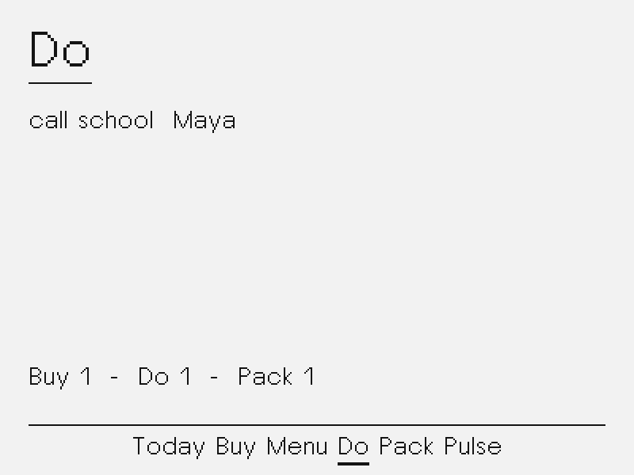
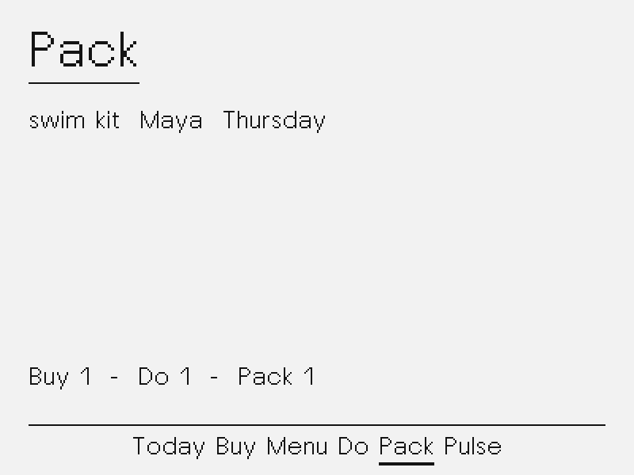
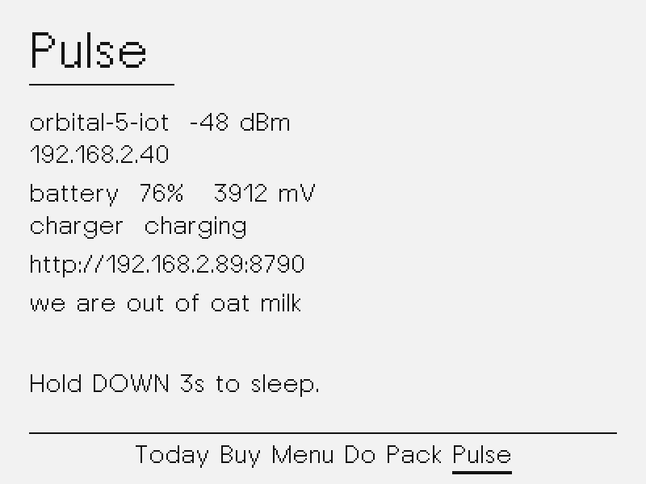
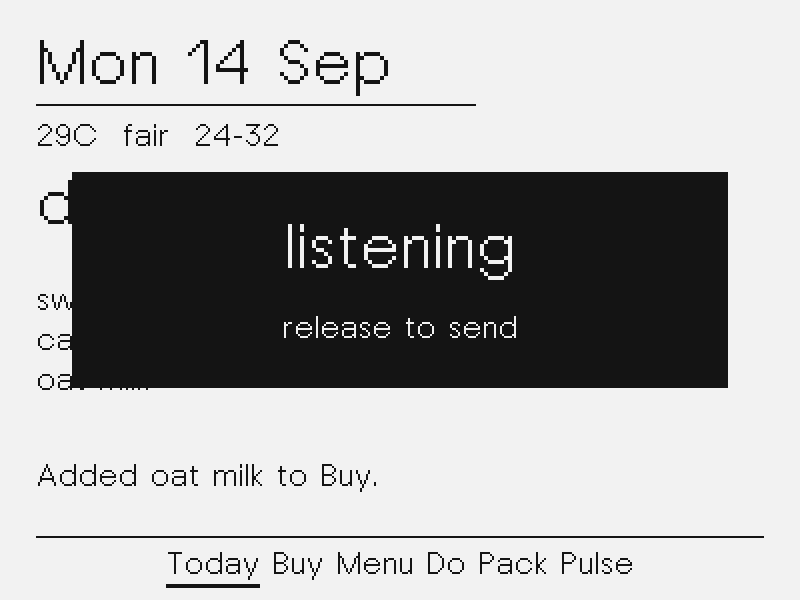

# Board, Today, Buy, Menu, Do, Pack

Step 3 plus Step 4 of [PLAN.md](PLAN.md): the kitchen board on the fridge.

The hub owns a JSON board. After STT it asks the `hearth` Hermes profile
to file the utterance. The NOTE4 paints posters from a flat JSON payload.
Hub-rendered 16-gray bitmaps stay for step 5. Telegram is deferred; voice
is the mouth.

## What it does

| Screen | Job |
|---|---|
| Today | Date, weather, tonight's meal, then pack/do/buy lines |
| Buy | Open shopping list, owner suffix when named |
| Menu | Mon–Sun dinners, today marked |
| Do | Household work, owner suffix when named |
| Pack | Bags and leaving-the-house items |
| Pulse | Battery, Wi-Fi, last heard phrase, hub URL |

- **Hold OK:** listen until release, cap 12 s. Overlay `listening` then `sending`.
- After a turn the poster shows one ack line (`Added oat milk to Buy.`).
- **UP / DOWN:** wrap Today → Buy → Menu → Do → Pack → Pulse.
- Completions are first-class (`we got eggs` ticks the Buy row).
- Named people become an owner suffix. Unnamed items stay household-owned.

## Board

Canonical store: `~/.local/share/hearth/board.json` (gitignored live file).
Hermes chat memory is not the source of truth.

```
GET  /v1/board
POST /v1/board/apply   {"ops":[...], "source":"fridge"}
GET  /v1/poster        flat keys the firmware can parse
POST /v1/utterance      STT, then file, then poster fields + ack
```

Apply ops: `add` / `complete` on `buy|do|pack`, and `set_menu`.

Weather is a hub Open-Meteo one-liner. Coords live in gitignored `.env`
(`HEARTH_LAT` / `HEARTH_LON`). Copy `.env.example` (Whitefield, Bengaluru
sample) and keep `.env` out of git. If those are unset, Today shows
`weather unknown`.

## Hermes

Profile alias `hearth` on `hermes-incus`. Install SOUL + skill:

```bash
./tools/install_hearth_profile.sh
```

The hub files with a fresh oneshot each time (`hearth --yolo --skills
hearth-board -z '…'`). The board is the source of truth, so a shared Hermes
session is not required.

## Hub

```bash
python3 -m hub --host 0.0.0.0 --port 8790
```

`--no-hermes` transcribes only. `--mock-hermes` files with a tiny heuristic
(for tests, not the kitchen).

`POST /v1/utterance` still takes 16 kHz PCM16 WAV. The JSON also carries
`ack`, `date`, `weather`, `meal`, `n_buy` / `n_do` / `n_pack`, `t0`…`t5`,
`b0`…`b7`, `d0`…`d5`, `p0`…`p5`, `m0`…`m6`.

## Simulator

```bash
make -C sim run
```






