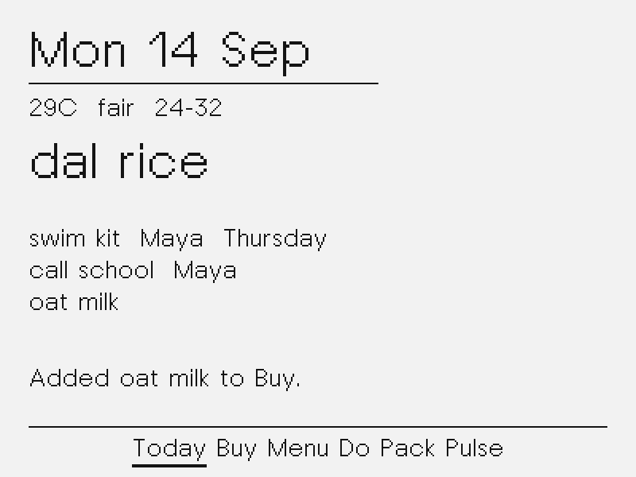
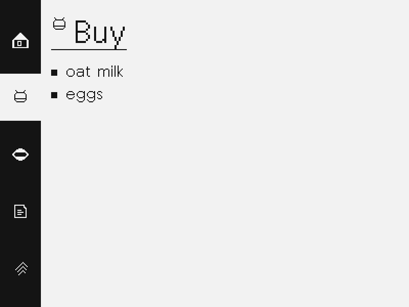
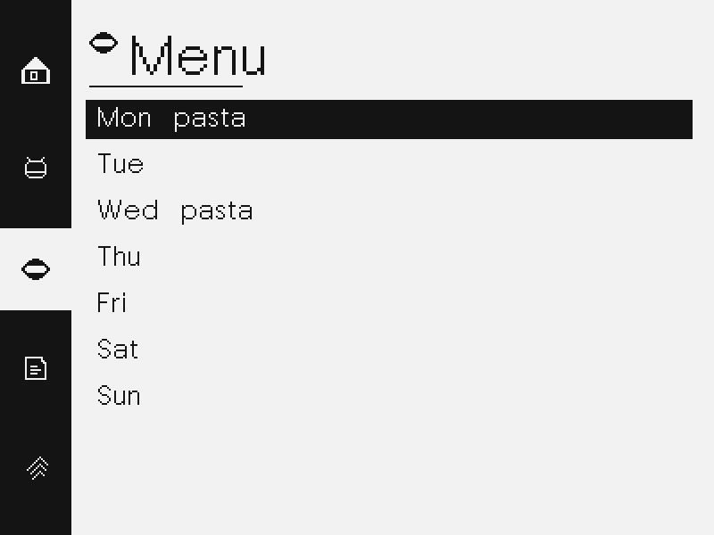
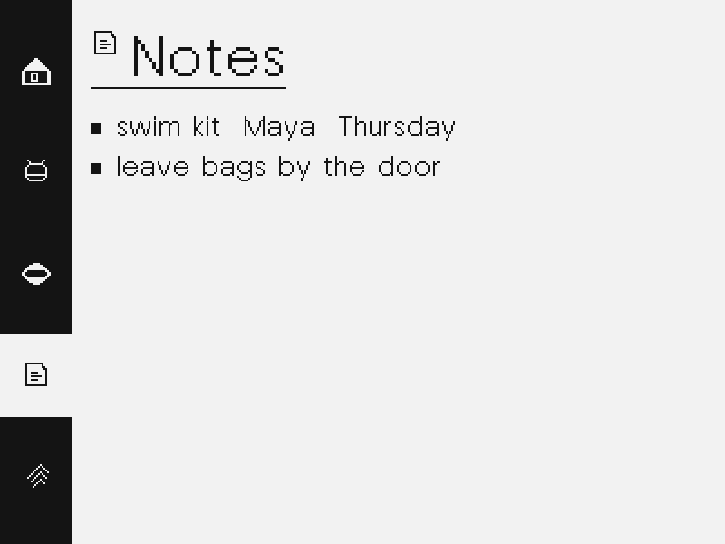
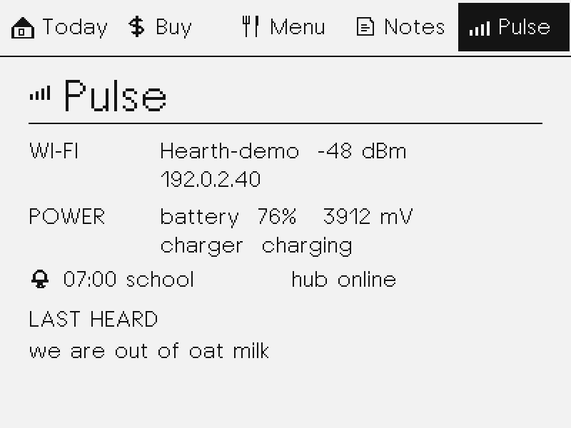
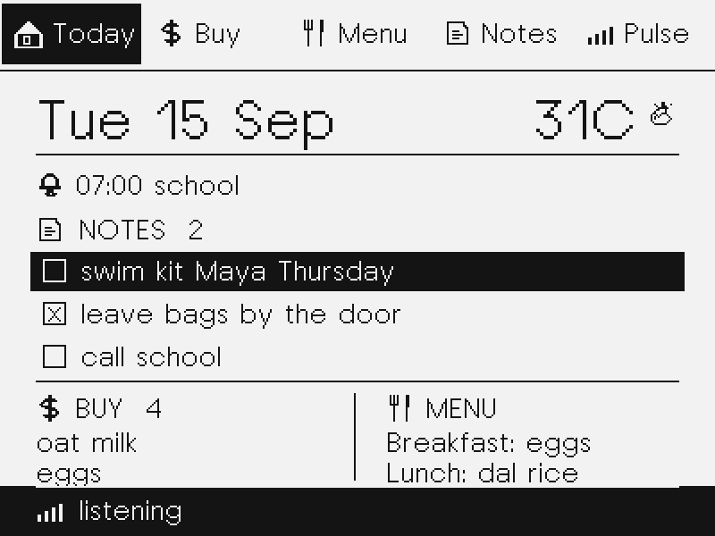
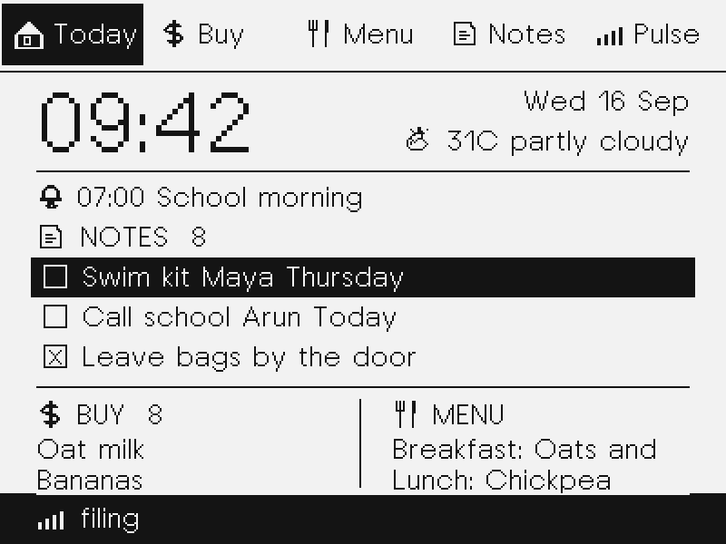
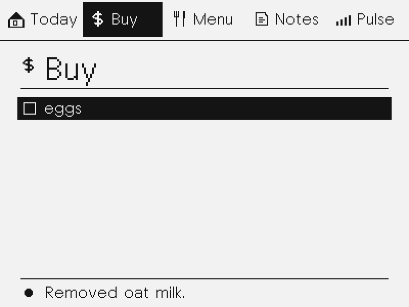

# Board, Today, Buy, Menu, Notes

Kitchen posters on the fridge. The hub owns JSON; Hermes interprets every
spoken command and calls the Hearth board tools to make changes.
The NOTE4 paints from a flat poster. The final UI is high-contrast 1-bit so
text stays crisp and status changes can use fast partial refreshes.

## What it does

| Screen | Job |
|---|---|
| Today | RTC time, date, weather, alarm, prominent selectable notes, split footer with two Buy and two upcoming Menu items |
| Buy | Shopping rows with checked and unchecked status |
| Menu | Full weekday headings with Breakfast, Lunch, and Dinner meals below each day |
| Notes | Chores, bags, thoughts with checked and unchecked status |
| Pulse | Battery, Wi-Fi, last heard phrase, hub status, alarm |

- A labeled top rail uses house **Today**, `$` **Buy**, fork-and-knife **Menu**,
  paper **Notes**, and signal **Pulse**. The active poster is reversed in black.
- **Hold OK (~0.45 s):** listen until release, cap 12 s. A bottom status bar says
  `listening`, then `sending`, then `filing`. The poster stays on screen. The
  hold is timed from the moment the button is first felt, and a hold that
  releases before it becomes usable speech is treated as the short press it
  looked like: the page turns instead of a “hold longer” complaint.
- Recording and network transfer run on separate device tasks. Page buttons
  remain usable during `sending` and `filing`, and up to four new recordings
  can wait locally. The hub accepts each WAV immediately and processes up to
  eight queued recordings in order through STT and Hermes. The bar shows the
  queue while `/v1/poster` reports `pending=1`, then the verified ack.
- **Short OK:** cycle Today → Buy → Menu → Notes → Pulse.
- **UP / DOWN:** move or scroll the selected item within the current page.
- **Long UP (~0.9 s):** check or uncheck the selected note or Buy item. Today selects notes.
- **Long DOWN (~0.9 s):** delete the selected note, Buy item, or Menu entry by its ID/key.
  ~20 s idle snaps to Today (the status bar stays if still filing).
- Only the rows that differ from the glass are refreshed, and a poster that
  differs only in its `clock` field is not painted at all. A minute tick is a
  few rows; a page turn is the whole screen; an identical frame is nothing.
- Every spoken command goes to the dedicated Hermes agent. The hub supplies a
  fresh board snapshot with stable IDs, while the Hearth MCP tools expose read,
  add, complete, toggle, delete, meals, and alarms. The hub acknowledges only
  changes confirmed by board operation results; an unmatched delete never says
  it removed an item.
- Named people become an owner suffix. Unnamed items stay household-owned.
- **Menu:** each weekday has a full heading and its Breakfast, Lunch, and
  Dinner entries underneath. Today’s footer shows the next two scheduled
  meals after the current local time, using meal labels such as `Lunch: dal`.
- **Alarm/timer:** “set an alarm for 7 for school” schedules the next 07:00; “30 second alarm” and “30 second timer” both schedule a dated, second-precise one-shot. The hub syncs the NOTE4 RTC from its local clock; the ES8311 plays a louder multi-second chime at the due time, then the alarm is cleared. A recording that overlaps the alarm can delay the chime by up to 70 seconds.

## Board

Canonical store: `~/.local/share/hearth/board.json` (gitignored live file).
Hermes chat memory is not the source of truth.

```
GET  /v1/board
POST /v1/board/apply   {"ops":[...], "source":"fridge", "run_id":"..."}
GET  /v1/poster        flat keys the firmware can parse
POST /v1/utterance      validate WAV, return request_id immediately; queued STT + agent filing
```

Apply ops: `add` / `complete` / `toggle` / `delete` / `clear_list` on `buy|notes`, plus `set_menu`, `delete_menu`,
`set_alarm`, `set_timer`, `clear_alarm`. Old `do`/`pack` list names still file into Notes.

Weather is a hub Open-Meteo one-liner plus a `wx` token (`sun` / `cloud` /
`partly` / `rain` / `storm` / `snow` / `fog`) for the icon. Coords live in gitignored
`.env` (`HEARTH_LAT` / `HEARTH_LON`).

## Hermes

The NOTE4 talks only to the hub. Hermes can run locally or on an SSH host. The hub handles
STT intake, weather, storage, the poster, and verified operation results.
Hermes receives every transcript and the current board, then calls the native
Hearth MCP tools agentically. A small stdio MCP bridge on the Hermes profile
exposes the board API as 12 named tools.

Install the dedicated `hearth` SOUL, skill, and MCP tools with the method and
profile location configured in `.env`:

```bash
./tools/install_hearth_profile.sh --dry-run
./tools/install_hearth_profile.sh
```

Every phrase uses a fresh one-shot with the configured Hermes command (for
example, `hearth --yolo --skills hearth-board -z '…'`). The installer pins only this profile to
`openai-codex / gpt-5.6-luna` with reasoning disabled; default and sibling
Hermes profiles are untouched. `POST /v1/utterance` returns `request_id` and
queue depth immediately. The device keeps the UI live and polls `/v1/poster` for
the transcript, queue depth, alarms, and ack: every 2 s while something is
filing, every 10 s while a button has recently been pressed, every 60 s when the
board is idle, and every 5 min once an idle stretch has proved nothing is
changing. A failed fetch retries in 20 s. See [POWER.md](POWER.md).

## Hub

```bash
python3 -m hub --host 0.0.0.0 --port 8790
```

`--no-hermes` transcribes only. `--mock-hermes` files with a tiny heuristic
(for tests, not the kitchen).

`POST /v1/utterance` still takes 16 kHz PCM16 WAV and accepts an
`X-Hearth-Request-Id` header to avoid duplicating a retried upload. The
`GET /v1/poster` JSON carries `heard`, `queue`, `ack`, `pending`, `date`,
`weather`, `wx`, `meal`, `n_buy` / `n_notes`,
`b0`…`b11`, `n0`…`n11` with IDs and status, `m0`…`m20` with menu keys,
`pb0`/`pb1` and `pm0`/`pm1` for Today’s split footer,
`alarm`, `aid`, `adate`, `ahh`, `amm`, `asec`, and `clock` for RTC sync.

## Simulator

```bash
make -C sim run
```

Visual direction: [the Hearth e-paper concept](design/hearth-eink-concept.png).









