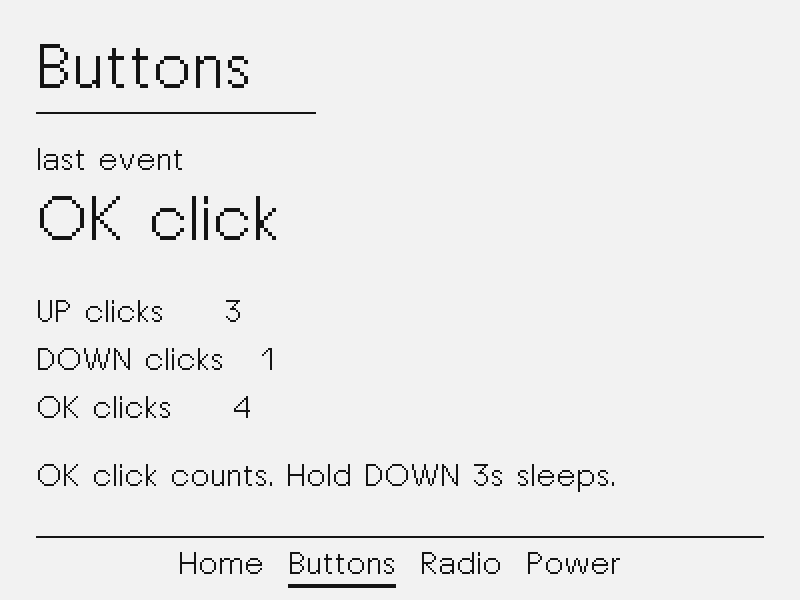

# Firmware bring-up

Step 1 of [PLAN.md](PLAN.md): ESP-IDF on the official NOTE4 board support.
The device is still a thin client. This image only proves display, buttons,
power-hold, Wi-Fi scan, and sleep.

## What it does

After flash, the panel shows **Home**: large `HEARTH`, battery, and radio
status. Four screens wrap with UP / DOWN:

| Screen | Job |
|---|---|
| Home | Identity, battery, last scan count |
| Buttons | Last event and click counts |
| Radio | 2.4 GHz AP scan, OK to rescan |
| Power | Millivolts, charger, shutdown hint |

- **UP / DOWN click:** previous / next screen (full refresh).
- **OK click:** rescan on Radio; otherwise refresh power/counts (partial).
- **OK hold (1.5 s):** jump Home.
- **DOWN hold (3 s):** white full refresh, drop the battery latch, deep sleep.
  On USB the latch has no effect; the panel stays cleared in deep sleep.

There is no Wi-Fi STA connection and no hub yet. Scan-only is enough to prove
the radio. Provisioning comes with the hub.

## Build and flash

ESP-IDF v6.1 via EIM, same wrapper as other NOTE4 projects on this machine:

```bash
./tools/idf.sh set-target esp32s3
./tools/idf.sh build
./tools/idf.sh -p /dev/ttyACM0 flash monitor
```

The first configure downloads `espressif/esp_codec_dev` (the board component
links it even though bring-up does not play audio).

Exit the monitor with `Ctrl+]`.

This **replaces** the as-found image. Restore with
`python3 tools/note4_flash.py restore --i-know-this-overwrites-the-device`
after reading [FACTORY_FLASH.md](FACTORY_FLASH.md).

## Simulator

The host simulator compiles the same canvas and screen files and writes PNGs:

```bash
make -C sim run
```

Frames land in `sim/out/01-home.png` … `04-power.png`, 2× the 400 × 300 panel.





## Serial

USB-Serial/JTAG is the console at 115200. Look for:

```
hearth: Hearth v0.1.0-bringup
hearth: splash painted
hearth_wifi: scan found N AP(s)
hearth: wifi scan painted
```
