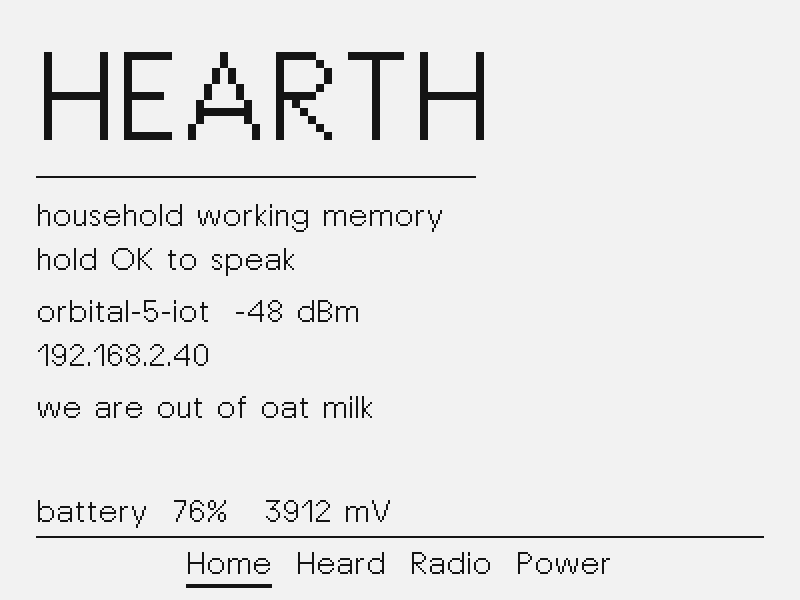
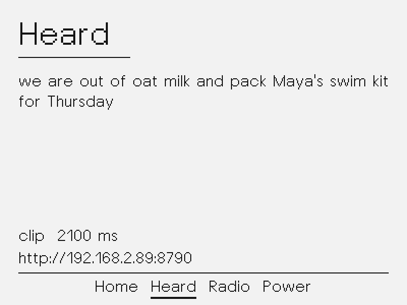
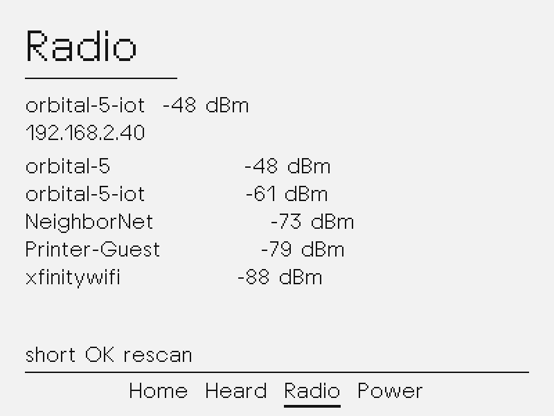
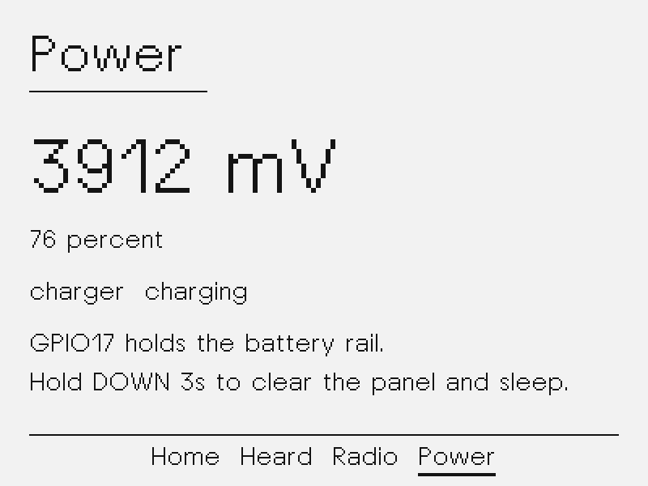
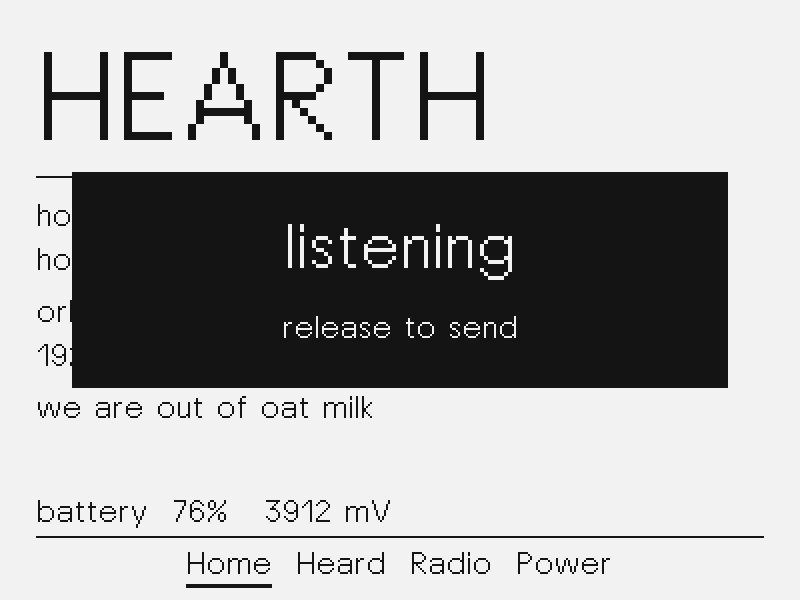

# Voice to transcript

Step 2 of [PLAN.md](PLAN.md): hold the front button, speak, see the words.

The hub still does not file a board or draw posters. This image records a
16 kHz clip, POSTs it to the hub, and paints the transcript on **Heard**.

## What it does

| Screen | Job |
|---|---|
| Home | Identity, Wi-Fi, last transcript |
| Heard | Full last phrase, clip length, hub URL |
| Radio | STA status, scan list; short OK rescans |
| Power | Battery and the 3 s DOWN shutdown |

- **Hold OK:** listen until release, cap 12 s. Overlay `listening` then `sending`.
- **Short OK:** rescan on Radio; ignored elsewhere (hold is speak).
- **UP / DOWN click:** previous / next screen.
- **DOWN hold 3 s:** white panel, battery latch, deep sleep.

Wi-Fi STA uses Kconfig defaults, then NVS. Console on USB-Serial/JTAG:

```
hearth> hearth-show
hearth> hearth-set ssid <name>
hearth> hearth-set pass <password>
hearth> hearth-set hub http://192.168.2.89:8790
hearth> hearth-save
hearth> hearth-reboot
```

SSID and password belong in `firmware/sdkconfig.defaults.local` (gitignored).
See `firmware/sdkconfig.defaults.local.example`.

## Hub

```bash
python3 -m hub --host 0.0.0.0 --port 8790 \
  --stt-url http://127.0.0.1:8080/v1/audio/transcriptions \
  --stt-model qwen3-asr-0.6b-cpu
```

`POST /v1/utterance` with `Content-Type: audio/wav` (16 kHz PCM16 mono, ≤ 4 MiB)
returns `{text, raw, ms, model}`. Qwen's `language …<asr_text>…` wrap is stripped.

## Simulator

```bash
make -C sim run
```






